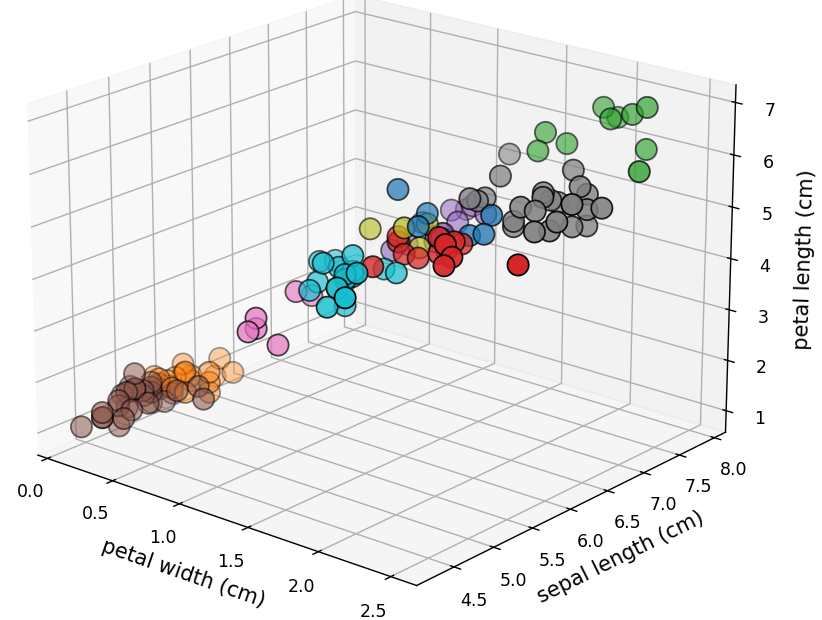

# Customer Personality Analysis


---

## 1. Introduction à la Classification Non Supervisée

Dans un marché saturé, la segmentation démographique classique (âge, genre) ne suffit plus. Ce projet de **Customer Personality Analysis** utilise le **Machine Learning non supervisé** (clustering) pour regrouper dynamiquement les clients selon leurs comportements d'achat réels. 

La classification non supervisée (ou *clustering*) est une branche du Machine Learning où l'algorithme doit apprendre à structurer des données sans aucune étiquette (label) préalable. L'objectif est de regrouper les individus au sein de clusters homogènes, de telle sorte que :
- Les individus d'un même groupe soient les plus **similaires** possibles (cohésion).
- Les différents groupes soient les plus **distants** possibles (séparation).

---

### La Problématique

> *Comment structurer une base clients hétérogène en groupes homogènes, sans étiquettes préalables, pour personnaliser les stratégies marketing et maximiser le ROI ?*

---

### Objectifs du Projet

* **Veille Technologique :** Évaluer et comparer 3 algorithmes clés (**K-Means, DBSCAN, CAH**).
* **Préparation des Données (EDA) :** Nettoyer et normaliser le dataset (Revenus, Score de dépenses).
* **Modélisation & Optimisation :** Ajuster les hyperparamètres et valider la qualité des clusters via le **score de Silhouette**.
* **Déploiement Métier :** Traduire les groupes mathématiques en *personas* et actions marketing concrètes.

---

## 2. Veille Technologique : Analyse des 3 Algorithmes Étudiés

### A. K-Means (Partitionnement)

* **Principe :** On fixe $k$ (le nombre de groupes). L'algorithme place des "points de ralliement" au hasard, puis chaque client rejoint le centre le plus proche. Le centre se déplace ensuite au milieu exact du nouveau groupe formé. On répète jusqu'à ce que les centres ne bougent plus.
* **Force :** Haute performance sur les grands jeux de données ; interprétabilité simple.
* **Limite :** $k$ doit être défini *a priori* ; vulnérable aux valeurs aberrantes (outliers).
* **Usage idéal :** Segmentation client.

#### Formule de la Distance (Distance Euclidienne)

$$dist(p, q) = \sqrt{\sum_{j=1}^{n} (p_j - q_j)^2}$$

* **$dist(p, q)$ :** La distance "à vol d'oiseau" entre deux points (le client $p$ et le centre $q$).
* **$\sqrt{\quad}$ :** La racine carrée, utilisée pour obtenir une distance réelle après avoir élevé les écarts au carré.
* **$\sum$ :** Le symbole de la somme, indiquant qu'on additionne les écarts de toutes les caractéristiques.
* **$j$ :** L'index d'une caractéristique spécifique (ex: l'âge, le revenu).
* **$n$ :** Le nombre total de caractéristiques (la dimensionnalité des données).
* **$(p_j - q_j)$ :** L'écart entre la valeur de la caractéristique $j$ pour le client et la valeur de cette même caractéristique pour le centre.
* **$^2$ :** L'exposant au carré, qui permet de rendre toutes les différences positives (les écarts négatifs deviennent positifs).

#### Formule de l'Inertie (Compacité du groupe)

$$W = \sum_{i=1}^{k} \sum_{x \in C_i} ||x - \mu_i||^2$$

* **$W$ :** L'inertie totale (la mesure de la dispersion des points dans leurs groupes).
* **$\sum_{i=1}^{k}$ :** La somme pour chaque groupe (de 1 jusqu'au nombre total de groupes $k$).
* **$\sum_{x \in C_i}$ :** La somme pour chaque point $x$ appartenant au groupe $C_i$.
* **$||x - \mu_i||^2$ :** La distance au carré entre le point $x$ et le centre du groupe $\mu_i$ (le centroïde).
* **$\mu_i$ :** La position du centre (moyenne) du groupe $i$.

---

### B. DBSCAN (Basé sur la densité)

* **Principe :** Regroupe les points selon leur densité locale. Les zones clairsemées sont marquées comme "bruit".
* **Force :** Aucun $k$ à définir ; capable d'identifier des formes non-sphériques complexes.
* **Limite :** Très sensible au paramètre de voisinage ($\epsilon$).
* **Usage idéal :** Détection d'anomalies (outliers) et données spatiales complexes.

#### Formule du Voisinage (Critère de densité)

$$N_\epsilon(p) = \{q \in D \mid dist(p, q) \le \epsilon\}$$

* **$N_\epsilon(p)$ :** Le voisinage du point $p$ (l'ensemble des points voisins).
* **$\{q \in D\}$ :** L'ensemble de tous les points $q$ disponibles dans ton jeu de données $D$.
* **$dist(p, q)$ :** La distance (euclidienne) entre le point $p$ et le point $q$.
* **$\le \epsilon$ :** La condition qui définit la limite du voisinage (le rayon epsilon).

---

### C. CAH (Classification Ascendante Hiérarchique)

* **Principe :** Approche "bottom-up". Chaque point débute comme un cluster unique. À chaque itération, les deux clusters les plus proches fusionnent.
* **Force :** Pas besoin de définir $k$ à l'avance ; dendrogramme pour visualiser la hiérarchie.
* **Limite :** Complexité calculatoire élevée ($O(n^3)$), inadapté aux très gros volumes de données.
* **Usage idéal :** Analyse exploratoire où la compréhension de la structure est prioritaire.

#### Formule de la Distance de Ward (Critère de fusion)

$$\Delta(C_i, C_j) = \frac{|C_i| \cdot |C_j|}{|C_i| + |C_j|} ||\mu_i - \mu_j||^2$$

* **$\Delta(C_i, C_j)$ :** L'augmentation de l'inertie totale causée par la fusion des groupes $C_i$ et $C_j$.
* **$|C_i|$ et $|C_j|$ :** Le nombre de points contenus dans chaque groupe.
* **$|C_i| + |C_j|$ :** Le nombre total de points après la fusion.
* **$||\mu_i - \mu_j||^2$ :** La distance au carré entre les deux centres (centroïdes) des groupes.

> **Objectif de la formule :** Elle minimise l'étalement du nouveau groupe en favorisant la fusion de groupes déjà compacts et de taille similaire.

---

## 3. Sélection du Nombre Optimal de Clusters et Mesure de Qualité

Dans un contexte d'apprentissage non supervisé, les données ne possèdent pas d'étiquettes de vérité terrain (*ground truth*). L'analyste doit donc s'appuyer sur des critères mathématiques internes pour évaluer la pertinence du découpage et choisir la configuration idéale.

---

### A. La Méthode du Coude (Elbow Method)

Cette méthode est principalement utilisée pour déterminer la valeur optimale du nombre de clusters $k$ dans les algorithmes de partitionnement comme le K-Means.

#### 1. Principe
L'algorithme K-Means est exécuté plusieurs fois en faisant varier $k$ (par exemple de 1 à 10). Pour chaque valeur de $k$, on calcule l'**Inertie intra-classe totale** ($W$). On trace ensuite la courbe de l'inertie en fonction de $k$.
L'inertie diminue naturellement à chaque fois que l'on ajoute un cluster. On recherche visuellement le point d'inflexion de la courbe (le "coude") : c'est le point où l'ajout d'un cluster supplémentaire n'apporte plus de gain significatif en termes de compacité.


#### 2. Rappel de la formule de l'Inertie ($W$)

$$W = \sum_{i=1}^{k} \sum_{x \in C_i} ||x - \mu_i||^2$$

* **$W$ :** L'inertie intra-classe globale. Plus elle est proche de 0, plus les clusters sont compacts.
* **$k$ :** Le nombre de clusters testé.
* **$C_i$ :** Le cluster numéro $i$.
* **$x$ :** Un point de données affecté au cluster $C_i$.
* **$\mu_i$ :** Le centroïde (centre géométrique) du cluster $C_i$.
* **$||x - \mu_i||^2$ :** La distance euclidienne au carré entre le point et son centre.


---

### B. Le Score de Silhouette (Silhouette Coefficient)

Le score de Silhouette est une mesure globale et individuelle de la qualité du clustering. Il évalue si un point est correctement positionné au sein de son groupe par rapport aux groupes voisins.

#### 1. Formule du coefficient pour un individu $i$

$$s(i) = \frac{b(i) - a(i)}{\max(a(i), b(i))}$$

#### 2. Explication détaillée des symboles

* **$s(i)$ :** Le score de silhouette de l'observation $i$. Ce score est toujours compris entre -1 et 1.
* **$a(i)$ (La Cohésion) :** La distance moyenne entre l'observation $i$ et tous les autres points appartenant au **même** cluster. Plus $a(i)$ est petit, plus l'observation est proche de ses pairs (groupe compact).
* **$b(i)$ (La Séparation) :** La distance moyenne entre l'observation $i$ et tous les points du cluster **voisin le plus proche** (le cluster dont la distance moyenne avec $i$ est minimale, hors de son propre groupe). Plus $b(i)$ est grand, plus l'observation est isolée des autres groupes.
* **$\max(a(i), b(i))$ :** Le facteur de normalisation. Il prend la valeur la plus grande entre $a(i)$ et $b(i)$ pour s'assurer que le résultat final reste strictement confiné dans l'intervalle $[-1, 1]$.

#### 3. Interprétation du Score Global

Le score global du modèle est la moyenne des scores $s(i)$ de toutes les observations.

* **Proche de 1 :** Les clusters sont denses, bien séparés et chaque point est à sa place.
* **Proche de 0 :** Les clusters se chevauchent de manière importante ; les points sont situés sur les frontières de décision.
* **Proche de -1 :** Les points ont été affectés au mauvais cluster (ils sont plus proches du groupe voisin que du leur).


Voici le code Markdown complet, prêt à être copié et collé directement dans ton fichier `README.md` :

## 4. Implémentation Personnalisée et Benchmark

### A. Algorithme K-Means "Maison"

Pour maîtriser les mécanismes géométriques du partitionnement, l'algorithme K-Means a été entièrement réimplémenté en Python à l'aide de la bibliothèque NumPy. 

```python
import numpy as np

def euclidean_distance(x1, x2):
    """
    Calcul de la distance euclidienne entre deux points dans un espace n-dimensionnel.
    Parametres :
    x1 (array-like): Coordonnées du point1 .
    x2 (array-like): Coordonnées du point2 .
    Returns:
    nombre flottant de la distance euclidienne.
    """
    distance = np.sqrt(np.sum((x1 - x2) ** 2))
    return distance

class KMeansMaison:
    def __init__(self, n_clusters=3, max_iter=100):
        """ 
        CONSTRUCTEUR: Configurtion  du modèle K-Means.
        -k: Nombre de groupes (clusters) à former.
        -max_iter: Nombre maximum d'itérations pour l'algorithme.
        """
        self.k = n_clusters 
        self.max_iter = max_iter
        self.centroids = None     
        self.labels = None        
        self.inertia = None       
    
    def initialize_centroids(self, X): 
        """
        ETAPE 1: Le point de départ
        On choisit aléatoirement k points comme centroïdes initiaux.
        """
        centroids_idx = np.random.choice(X.shape[0], self.k, replace=False)
        return X[centroids_idx]  


    def assign_clusters(self, X, centroids):
        """ 
        ETAPE 2: Le tri des données
        """
        clusters = [[] for _ in range(self.k)]

        for idx_point, point in enumerate(X):
            distances = [euclidean_distance(point, center) for center in centroids]
            cluster_idx = np.argmin(distances)
            clusters[cluster_idx].append(idx_point)
        return clusters


    def update_centroids(self, X, clusters):
        """
        ÉTAPE 3 : Le déménagement des centres.
        """
        centroids = np.zeros((self.k, X.shape[1]))

        for i, cluster in enumerate(clusters):
            if len(cluster) == 0:
                centroids[i] = self.centroids[i]  
            else:
                centroids[i] = X[cluster].mean(axis=0)

        return centroids

    def fit(self, X):
        """
        Orcherstration de l'algorithme K-Means La boucle d'entrainement
        """
        # Étape 1 : Initialisation des centroïdes
        self.centroids = self.initialize_centroids(X) 

        for _ in range(self.max_iter):
            # Étape 2 : Assignation des échantillons aux clusters
            clusters = self.assign_clusters(X, self.centroids)

            prev_centroids = self.centroids
            
            # Les centres se déplacent vers la moyenne de leur groupe
            self.centroids = self.update_centroids(X, clusters)

            # Condition d'arrêt
            if np.allclose(self.centroids, prev_centroids):
                break

        # Attribution des labels
        self.labels = np.zeros(X.shape[0])
        for cluster_idx, point_indices in enumerate(clusters):
            self.labels[point_indices] = cluster_idx

        # Calcul de l'inertie
        self.inertia = 0
        for cluster_idx, point_indices in enumerate(clusters):
            for idx in point_indices:
                self.inertia += euclidean_distance(X[idx], self.centroids[int(self.labels[idx])]) ** 2
```


---

### B. Confrontation au Standard Industriel (Benchmark)

Afin de valider la rigueur mathématique du code développé, un protocole de test comparatif a été mis en place. Pour simuler une phase d'exploration à l'aveugle, le jeu de données Iris a été traité sans prendre en compte ses 3 classes réelles, en imposant volontairement une sur-segmentation forte à 10 clusters ($k = 10$).

```python
if __name__ == "__main__":
    from sklearn.datasets import load_iris
    from sklearn.cluster import KMeans

    print("\n=== BENCHMARK: K-MEANS MAISON VS SCIKIT-LEARN SUR IRIS ===")

    # 1. Chargement des données Iris
    iris = load_iris()
    X = iris.data

    # 2. CONFIGURATION DU NOMBRE DE CLUSTERS 
    CHOIX_K = 10
    np.random.seed(42) # reproducibilité des résultats pour le model maison

    # 3. Instanciation et entraînement
    model_maison = KMeansMaison(n_clusters=CHOIX_K)
    model_maison.fit(X)

    # 4. CONFIGURATION ET ENTRAÎNEMENT DU MODÈLE SCIKIT-LEARN
    model_sklearn = KMeans(n_clusters=CHOIX_K, random_state=42, n_init=10, max_iter=100)
    model_sklearn.fit(X)
```

---

### C. Analyse Synthétique des Résultats

L'exécution de ce benchmark met en évidence deux comportements distincts induits par les stratégies d'initialisation des deux modèles.

#### 1. Optimisation de l'Inertie et Rôle du Multi-Start
- **Inertie K-Means Maison :** 28.29
- **Inertie K-Means Scikit-Learn :** 25.97

L'algorithme de Scikit-Learn atteint une inertie globale plus faible, ce qui traduit des clusters géométriquement plus denses et mieux optimisés. Cet écart provient directement du paramètre `n_init=10`. Alors que le modèle personnalisé s'exécute en une seule tentative ("single-shot") dépendante du tirage initialisé par `np.random.seed(42)`, Scikit-Learn effectue 10 lancements indépendants complets et ne conserve que la meilleure convergence. Cette méthode permet d'éviter les pièges des minima locaux, fréquents lorsque la valeur de $k$ est élevée.

#### 2. Divergence de Frontières et Partage des Données
L'examen des 10 premiers échantillons révèle une indexation et une répartition structurellement différentes :
- **Labels Maison :** `[5 5 5 5 5 1 5 5 5 5]`
- **Labels Scikit-Learn :** `[2 8 8 8 2 7 8 2 8 8]`

Au-delà de la simple permutation des numéros de groupes (liée à l'ordre d'attribution des centres au départ), les frontières de décision divergent. Par exemple, Scikit-Learn sépare la première et la deuxième fleur (labels 2 et 8) là où le modèle maison les maintient au sein d'un même groupe (label 5). Le modèle de référence parvient à raffiner la fragmentation des données grâce à des centroïdes initiaux mieux positionnés dans l'espace.

